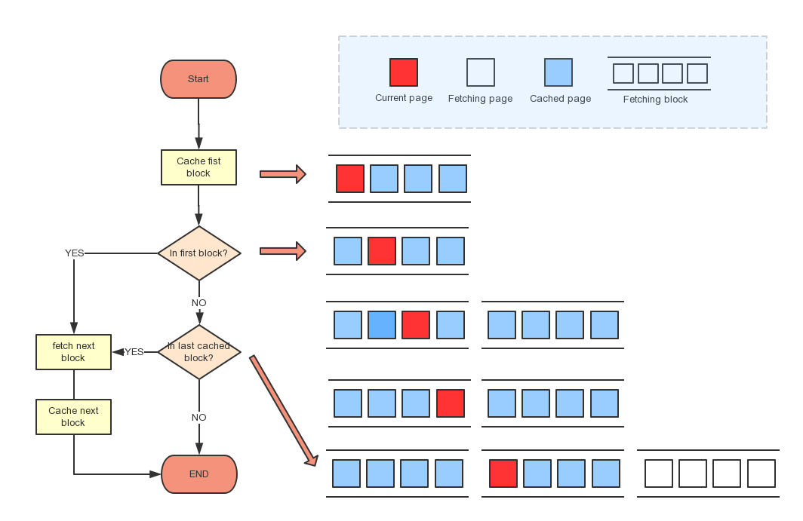
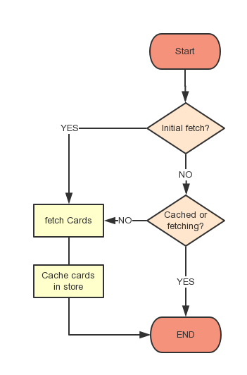

This project was bootstrapped with [Create React App](https://github.com/facebook/create-react-app).

# Accenture Tech Test

## How to run
#### Clone project repository from Github
`$ git clone https://github.com/franklw/accenture-tech-test.git`

#### Install dependencies
`$ npm install`

## Available Scripts

In the project directory, you can run:

### `$ npm start`

Runs the app in the development mode. 
Open [http://localhost:3000](http://localhost:3000) to view it in the browser.

The page will reload if you make edits. 
You will also see any lint errors in the console.

### `$ npm test`

Launches the test runner in the interactive watch mode. 

### `$ npm test -- --coverage`

Launches the test runner with coverage report. 

### `$ npm run build`

Builds the app for production to the `build` folder. 
It correctly bundles React in production mode and optimizes the build for the best performance.

The build is minified and the filenames include the hashes. 
Your app is ready to be deployed!

### `$ sh ./docker_build.sh <image_name>`

Build docker image of application with nginx.

### `$ docker run -d -p <port>:80 --name <instance_name> <image_name>`

In the build folder, use this command to run docker image.

## Technology stack
- React
- Material UI
- Redux
- Redux Thunk
- Enzyme + Jest

## UI implementation

## Data fetch and cache logic

App will cache 4 pages of card by default, and this param can be modified through constant PAGES_PER_BATCH in `/scr/constants` folder. 